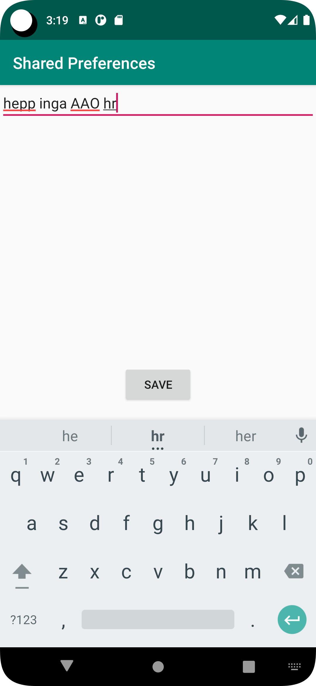
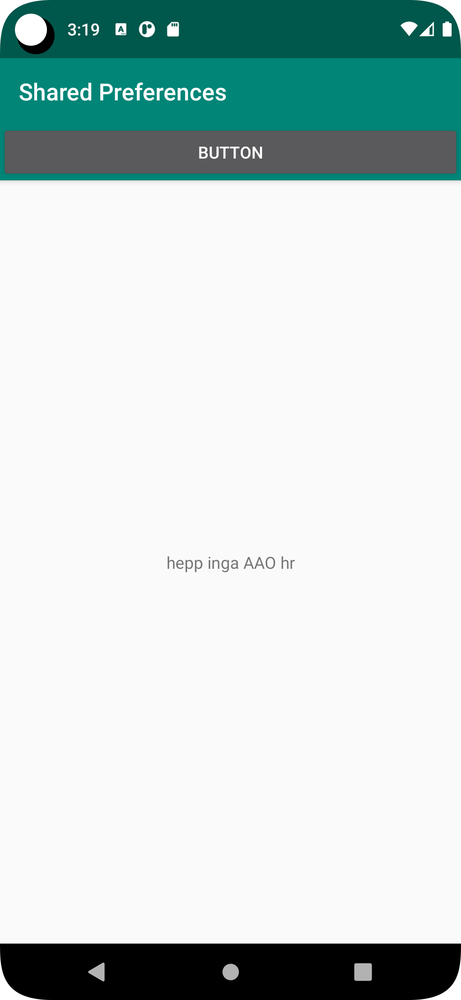

# Rapport

la till sen second activety och kastade in en text edit och en button.
här ansåg jag att en retunbutton inte behöves då all android kommer med en "back"knapp.

la till variablar i mina java filer 
```
    public static final String preferenser = "Shared Preference";
    private Button button;
    private EditText eText;
    
    private SharedPreferences myPreferenceRef;
    public TextView textView;
    private Button button;
```

började i min mainActivety2 class och instansigerade mina nya variabler och la till en on click litener
```
 eText = (EditText) findViewById(R.id.settingseditview);
        button = (Button) findViewById(R.id.prefButton);
        button.setOnClickListener(new View.OnClickListener() {
            @Override
            public void onClick(View view) {


                SharedPreferences sharedP = getSharedPreferences(preferenser, MODE_PRIVATE);
                SharedPreferences.Editor sharedPEdit = sharedP.edit();
                sharedPEdit.putString(preferenser, eText.getText().toString()).apply();
            }
        });
```
sen gjoder jag samma sak i min MainActivety
```
  textView = (TextView) findViewById(R.id.Text);

        myPreferenceRef = getPreferences(MODE_PRIVATE);


        button = (Button) findViewById(R.id.button);
        button.setOnClickListener(new View.OnClickListener() {
            @Override
            public void onClick(View view) {
                Intent intent = new Intent(MainActivity.this, MainActivity2.class);
                startActivity(intent);
            }
        });
    }
```

sen gjorde jag en metod för när man åtegick till första sidan,
satte in att diplaya det som man skrivit in i text editorn

```
super.onResume();
        SharedPreferences sharedPreferences = getSharedPreferences(MainActivity2.preferenser, MODE_PRIVATE);
        String textFromEditText = sharedPreferences.getString(MainActivity2.preferenser, "");
        textView.setText(textFromEditText);
```





L